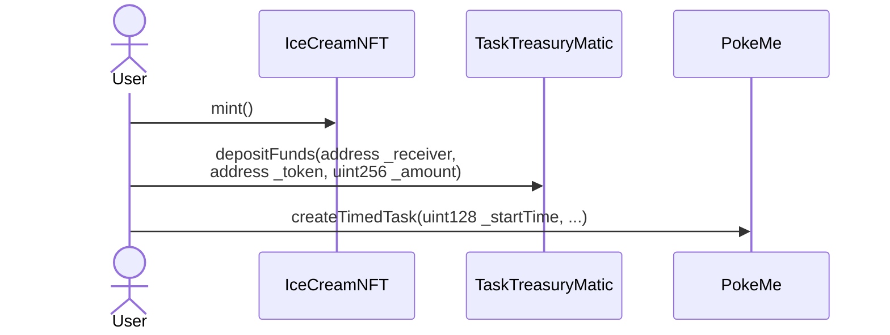
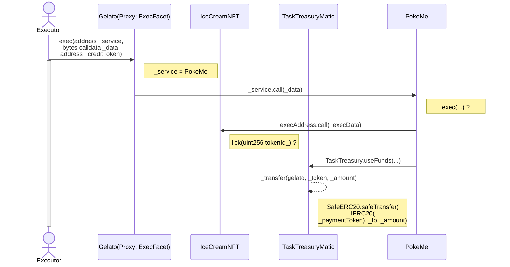

https://app.gelato.network/tutorial

# イメージ図

# 内容
Tutorial手順1: 自動化処理対象のNFTを獲得する 
Tutorial手順2: 実行手数料(Matic)をデポジットする 
Tutorial手順3: 自動化タスクを作成する 

Tutorial手順3で定義した実行タイミングが来たらExecutorにより自動的に処理が実行される(Executorのexec以外の処理については上手く追えなかったため省略)

# コントラクト
https://docs.gelato.network/resources/contract-addresses

:::details polygonscan

- [IceCreamNFT](https://polygonscan.com/address/0xb74de3f91e04d0920ff26ac28956272e8d67404d#code)
- [TaskTreasuryMatic](https://polygonscan.com/address/0xa8a7bbe83960b29789d5cb06dcd2e6c1df20581c#code)
- [PokeMe(Proxy)](https://polygonscan.com/address/0x527a819db1eb0e34426297b03bae11f2f8b3a19e#code)
- [PokeMe](https://polygonscan.com/address/0xB3f5503f93d5Ef84b06993a1975B9D21B962892F#code)
- [Gelato](https://polygonscan.com/address/0x7598e84b2e114ab62cab288ce5f7d5f6bad35bba#code)
- [ExecFacet](https://polygonscan.com/address/0x27ee02084023fd171e9798d33c8bba4255b24775#code)

:::

# 参考
https://docs.gelato.network/introduction/master
https://vividot-de.fi/entry/Gelato-Network
https://github.com/gelatodigital/gelato-network
https://github.com/gelatodigital/gelato-uniswap
https://medium.com/gelato-network/gelato-2021-year-in-review-903c5a16c6ad
